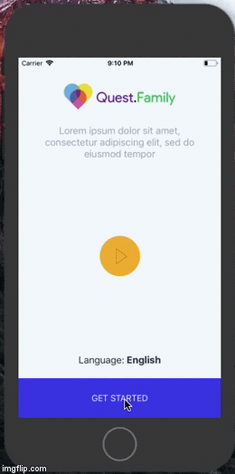

## React native quest 

 


### Запуск проекта

1) Для установки проекта нужно убедиться, что установлен `yarn`, подробнее о yarn [на официальном сайте](https://yarnpkg.com/en/docs/install).
1) Для привзяки библиотек в Xcode запустить: 
    ```$bash
    react-native link
    ```
1) После этого запустить команду, которая установит необходимые зависимости: 
    ```$bash
    yarn install --frozen-lockfile
    ``` 
1) Для Android компиляции необходима [установка java 1.8](https://www.oracle.com/technetwork/java/javase/downloads/jdk8-downloads-2133151.html)
   
   Для запуска на android симуляторе: 
    ```$bash
    react-native run-android
    ```    

1) Для запуска на ios симуляторе через Xcode 10 (Run) в режиме `Legacy build system`:
   ```$bash
        File -> project settings... -> build system (выбрать Legacy build system)
    ``` 
    
    
##### Android swipe animation fix:
В исходниках `react-native-navigation/lib/android/app/src/main/java/com/reactnativenavigation/viewcontrollers/stack/StackController.java:205`:
```$xslt
Options resolvedOptions = resolveCurrentOptions(presenter.getDefaultOptions());
```


